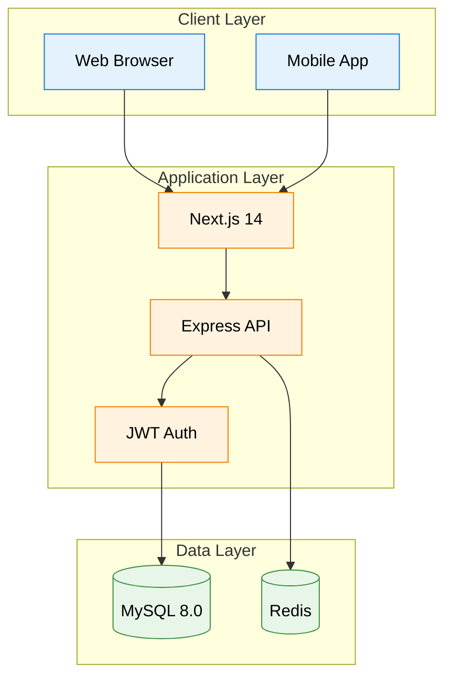
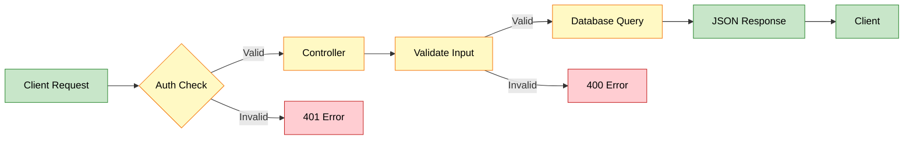
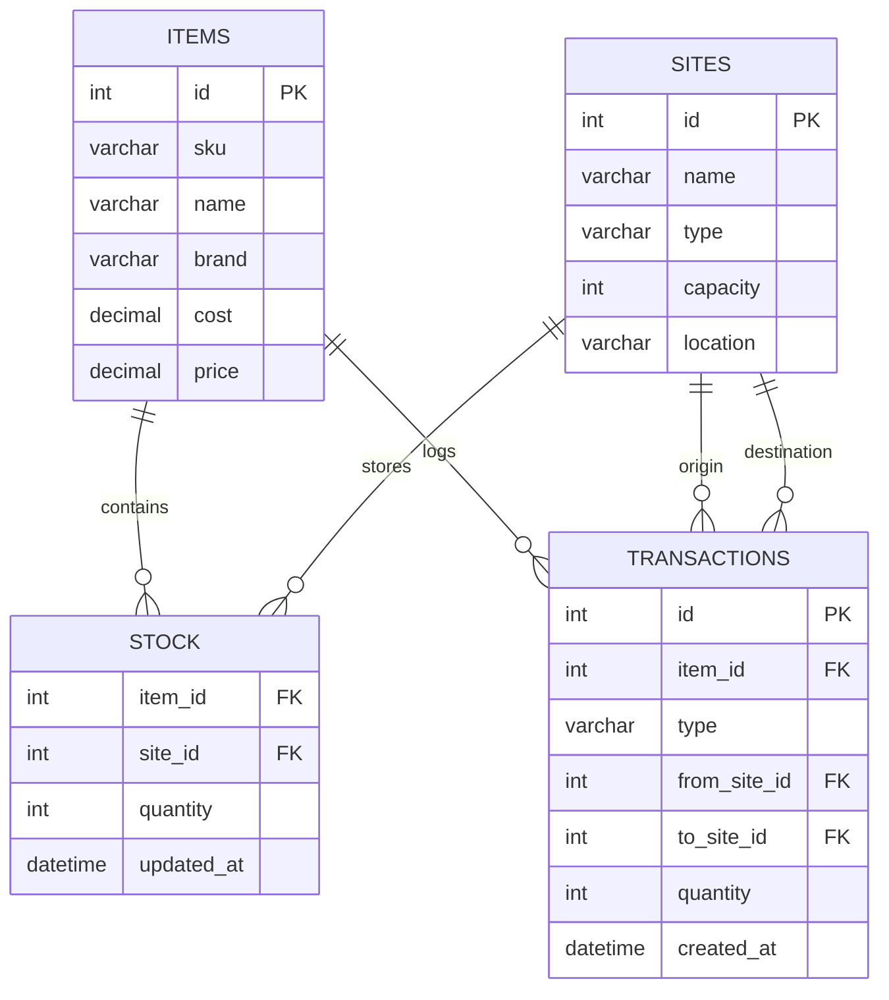

# AEC Inventory Management Tool

A comprehensive, full-stack inventory management solution tailored for Architecture, Engineering, and Construction (AEC) logistics. Designed to handle multi-site warehousing, real-time stock tracking, and predictive financial analysis.

## Live Demo

| Service | Link | Status |
|---------|------|--------|
| Frontend Dashboard | https://aec-inventory-app.vercel.app/ | Active |

---

## Table of Contents

- [Overview](#overview)
- [System Architecture](#system-architecture)
- [Database Schema](#database-schema)
- [Technology Stack](#technology-stack)
- [API Endpoints](#api-endpoints)
- [Installation](#installation)
- [Contributing](#contributing)

---

## Overview

The AEC Inventory Management Tool tackles construction supply chain challenges with multi-warehouse coordination, intelligent stock visualization, and financial optimization.

### Key Features

| Feature | Description |
|---------|-------------|
| **Dead Stock Detection** | Identifies items with no movement for 90+ days to recover frozen capital |
| **Transport Risk Radar** | Analyzes historical damage data across routes with probability scoring |
| **Site Synchronization** | Manages stock transfers between distribution centers and construction sites |

---

## System Architecture



### Request Flow



---

## Database Schema



---

## Technology Stack

| Layer | Technology |
|-------|-----------|
| **Frontend** | React 18, Next.js 14, Tailwind CSS, AmCharts 5 |
| **Backend** | Node.js, Express.js, JWT Authentication |
| **Database** | MySQL 8.0, Redis Cache |
| **Deployment** | Vercel (Frontend), VPS (Backend) |
| **Version Control** | Git, GitHub |

---

## API Endpoints

### Inventory Management

| Method | Endpoint | Description | Auth Required |
|--------|----------|-------------|---------------|
| `GET` | `/api/inv/items` | Get all inventory items | ✅ |
| `GET` | `/api/inv/items/:id` | Get specific item | ✅ |
| `POST` | `/api/inv/items` | Create new item | ✅ |
| `PUT` | `/api/inv/items/:id` | Update item | ✅ |
| `DELETE` | `/api/inv/items/:id` | Delete item | ✅ |

### Stock Management

| Method | Endpoint | Description | Auth Required |
|--------|----------|-------------|---------------|
| `GET` | `/api/stock` | Get stock levels by site | ✅ |
| `GET` | `/api/stock/:siteId` | Get stock for specific site | ✅ |
| `POST` | `/api/stock/adjust` | Adjust stock quantity | ✅ |

### Transactions

| Method | Endpoint | Description | Auth Required |
|--------|----------|-------------|---------------|
| `GET` | `/api/txn` | Get all transactions | ✅ |
| `POST` | `/api/txn` | Create new transaction | ✅ |
| `GET` | `/api/txn/:id` | Get transaction details | ✅ |

### Sites

| Method | Endpoint | Description | Auth Required |
|--------|----------|-------------|---------------|
| `GET` | `/api/sites` | Get all sites | ✅ |
| `POST` | `/api/sites` | Create new site | ✅ |
| `PUT` | `/api/sites/:id` | Update site | ✅ |

### Request/Response Examples

#### Get All Items
**Request:**
```http
GET /api/inv/items
Authorization: Bearer <token>
```

**Response:**
```json
{
  "success": true,
  "data": [
    {
      "id": 1,
      "sku": "TILE-CER-001",
      "name": "Ceramic Floor Tile",
      "brand": "Kajaria",
      "totalStock": 1250,
      "locations": [
        {"site": "Central Warehouse", "qty": 800},
        {"site": "Site A", "qty": 450}
      ]
    }
  ]
}
```

#### Create Transaction
**Request:**
```http
POST /api/txn
Authorization: Bearer <token>
Content-Type: application/json

{
  "itemId": 45,
  "type": "MOVE",
  "from": 1,
  "to": 3,
  "qty": 200,
  "notes": "Transfer for Project Phoenix"
}
```

**Response:**
```json
{
  "success": true,
  "data": {
    "id": 156,
    "itemId": 45,
    "type": "MOVE",
    "from": 1,
    "to": 3,
    "qty": 200,
    "createdAt": "2024-01-15T10:30:00Z"
  }
}
```

---

## Installation

### Prerequisites

| Requirement | Version |
|------------|---------|
| Node.js | 18+ |
| MySQL | 8.0+ |
| npm/yarn | Latest |

### Setup Steps

1. **Clone Repository**
```bash
git clone https://github.com/yourusername/aec-inventory.git
cd aec-inventory
```

2. **Backend Setup**
```bash
cd backend
npm install
```

Create `.env` file:
```env
DB_HOST=localhost
DB_USER=root
DB_PASSWORD=your_password
DB_NAME=aec_inventory
JWT_SECRET=your_secret_key
PORT=5000
```

Initialize database:
```bash
mysql -u root -p < schema.sql
npm start
```

3. **Frontend Setup**
```bash
cd frontend
npm install
```

Create `.env.local` file:
```env
NEXT_PUBLIC_API_URL=http://localhost:5000
```

Start development server:
```bash
npm run dev
```

4. **Access Application**
- Frontend: http://localhost:3000
- Backend API: http://localhost:5000

---

## Project Structure

```
aec-inventory/
├── backend/
│   ├── controllers/     # Business logic
│   ├── models/          # Database models
│   ├── routes/          # API endpoints
│   ├── middleware/      # Auth & validation
│   ├── config/          # Configuration
│   └── server.js        # Entry point
│
├── frontend/
│   ├── app/             # Next.js pages
│   ├── components/      # React components
│   ├── lib/             # Utilities
│   ├── public/          # Static assets
│   └── styles/          # CSS files
│
└── README.md
```

---

## Contributing

1. Fork the repository
2. Create feature branch (`git checkout -b feature/AmazingFeature`)
3. Commit changes (`git commit -m 'Add AmazingFeature'`)
4. Push to branch (`git push origin feature/AmazingFeature`)
5. Open Pull Request

---

## License

This project is licensed under the MIT License.
